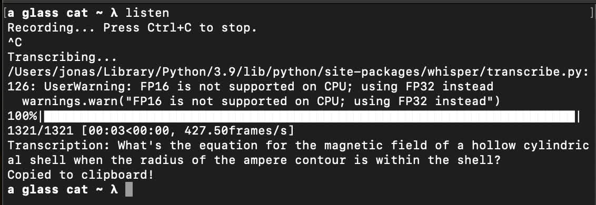

# Listen

A MacOS microphone speech-to-text script using Whisper.

## Installation

A python3 runtime is required.

1) Clone the repo: `git clone https://github.com/jonasiwnl/listen && cd listen`
2) Run `./install.sh`

This will install `brew` and `ffmpeg` if you don't already have them.

## TODO

- [ ] Better installation
- [x] Choose microphone cmd line option
- C++/Go port?
